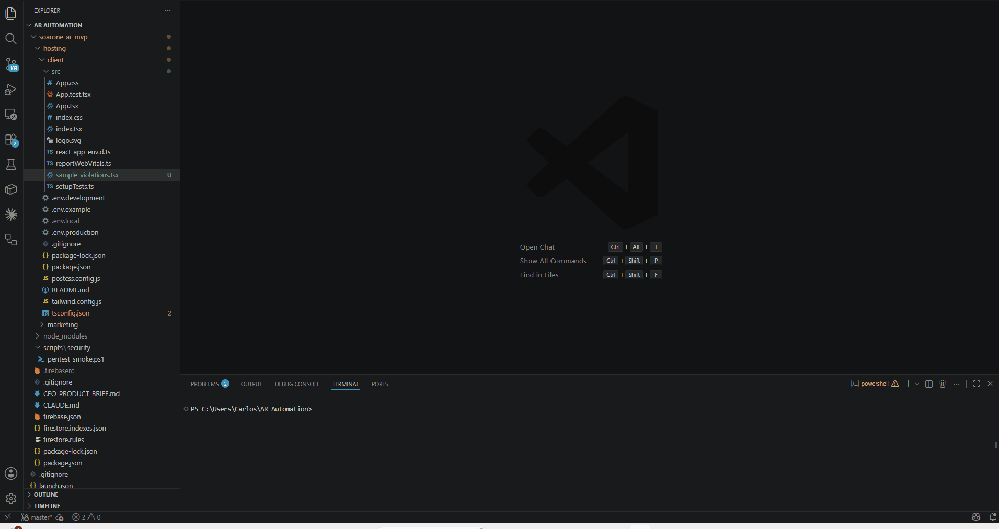
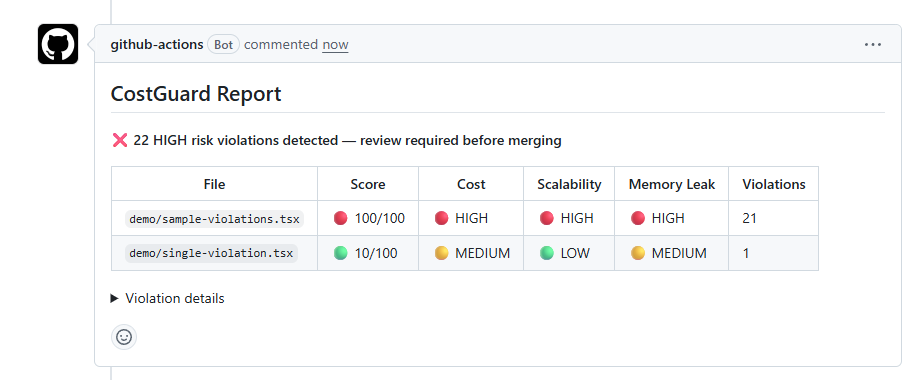

> Stop Firebase bill shock before it hits production — CostGuard catches
> expensive patterns as you type, blocks risky commits, and gates your deploys.



# CostGuard

Catch expensive Firebase and React patterns before they hit production — and before they hit your bill.

CostGuard is a VS Code extension that detects runaway Firestore reads, missing listener cleanup, render loops, and other cost-heavy patterns as you write code. It adds inline squiggles, a per-file risk score, and optional gates that block bad code from being committed, merged, or deployed.

**[Install from the VS Code Marketplace →](https://marketplace.visualstudio.com/items?itemName=soarone.costguard)**

---

## What it catches

**Example: one unbounded read can quietly cost ~$90/month**

```ts
// Bad — reads every document in the collection, on every load
const snap = await getDocs(collection(db, 'invoices')); // ← FCG002
```

If `invoices` has 10,000 documents and this query runs on a dashboard
visited by 500 users a day:

```
10,000 docs × 500 loads/day = 5,000,000 reads/day
5,000,000 × 30 days         = 150,000,000 reads/month
150,000,000 / 100,000 × $0.06 (Firestore read price) ≈ $90/month
```

— for one query, before the feature that uses it has shipped. CostGuard
flags this the instant you type it, with the fix inline:

```ts
// Fix — cap it, then paginate or query for more as needed
const snap = await getDocs(query(collection(db, 'invoices'), limit(50)));
```

---

## Features

### Live diagnostics
Squiggles appear as you type (500ms debounce). No save required.

### Copy fix prompt for AI
Click the lightbulb (or `Cmd/Ctrl+.`) on any squiggle and choose **Copy fix prompt for AI**. CostGuard copies the violation message plus the surrounding code to your clipboard as a ready-to-paste prompt — drop it straight into ChatGPT, Claude, or Copilot Chat to get a fix.

### Risk scoring
Every flagged file gets a score and a breakdown by risk category, visible inline and in the status bar.

```
$(shield) Risk Score: 82/100   Cost: HIGH   Scalability: MEDIUM   Memory Leak: HIGH
```

### Deployment gates
Three layers that stop risky code before it ships:

| Gate | When it runs | Blocks on |
|---|---|---|
| Pre-commit hook | `git commit` | HIGH risk |
| GitHub Actions PR gate | Every pull request | HIGH risk |
| Deploy gate | `npm run predeploy` | MEDIUM+ risk |

---

## Installation

1. Download `costguard-0.2.0.vsix`
2. Open VS Code → **Extensions** → `···` menu → **Install from VSIX**
3. Select the file and reload when prompted
4. The setup wizard appears automatically — choose which protection layers to enable

---

## Setup Wizard

On first install (and on every upgrade), a QuickPick appears ~1.5 seconds after VS Code loads:

```
CostGuard — Choose your protection layers

  ●  Pre-commit Hook         Block commits with HIGH risk violations
  ●  GitHub Actions PR Gate  Post risk card on PRs, block HIGH risk merges
  ○  Deploy Gate             Block firebase deploy on MEDIUM+ risk violations
```

Select what you want, press **Enter**. CostGuard writes all the necessary files automatically — no manual path setup.

To re-run the wizard at any time: **Command Palette** → `CostGuard: Setup`

---

## What it detects

### FCG001 — Unstable useEffect dependency `error`
Objects, arrays, functions, or call results used as `useEffect` dependencies without `useMemo`/`useCallback`. Every render creates a new reference, causing the effect to re-run infinitely — the root cause of most Firestore read runaway bills.

```ts
// Bad — query is a new object on every render
const query = { collection: 'invoices', status: 'open' };
useEffect(() => { fetchData(query); }, [query]); // ← FCG001

// Fix
const query = useMemo(() => ({ collection: 'invoices', status: 'open' }), []);
```

### FCG002 — Unbounded Firestore read `error`
`getDocs` or `collection` calls without `.limit()`. On a large collection this can read thousands of documents in one call.

```ts
// Bad
const snap = await getDocs(collection(db, 'invoices')); // ← FCG002

// Fix
const snap = await getDocs(query(collection(db, 'invoices'), limit(50)));
```

### FCG003 — Real-time listener on UI state `warning`
`onSnapshot` listeners that re-register whenever UI state like `activeTab`, `selectedId`, or `showModal` changes. Each re-registration opens a new listener and the old one may not be cleaned up.

```ts
// Bad — re-registers every time activeTab changes
useEffect(() => {
  return onSnapshot(collection(db, activeTab), ...);
}, [activeTab]); // ← FCG003
```

### FCG004 — onSnapshot without cleanup `error`
Real-time listeners must return their unsubscribe function. Without it, every component mount adds a new listener that never closes.

```ts
// Bad — listener leaks on every remount
useEffect(() => {
  onSnapshot(collection(db, 'invoices'), handler); // ← FCG004
}, []);

// Fix
useEffect(() => {
  return onSnapshot(collection(db, 'invoices'), handler); // return the unsub
}, []);
```

### FCG005 — Firestore read inside a loop `error`
`getDoc` or `getDocs` calls inside `for`, `while`, `forEach`, `map`, or similar constructs. Each iteration makes a separate network round-trip (N+1 reads).

```ts
// Bad — one read per invoice
for (const id of invoiceIds) {
  const doc = await getDoc(doc(db, 'invoices', id)); // ← FCG005
}

// Fix — use getAll / batched reads / a single query
```

### FCG006 — setInterval without cleanup `error`
`setInterval` inside `useEffect` without a corresponding `clearInterval` return. Intervals stack up on every remount, polling Firebase endlessly.

```ts
// Bad
useEffect(() => {
  setInterval(() => fetchStats(), 5000); // ← FCG006
}, []);

// Fix
useEffect(() => {
  const id = setInterval(() => fetchStats(), 5000);
  return () => clearInterval(id);
}, []);
```

### FCG007 — addEventListener without cleanup `error`
`addEventListener` inside a `useEffect` with no `removeEventListener` returned. Each remount adds a duplicate listener that's never removed, so handlers fire multiple times and the component leaks memory.

```ts
// Bad — listener leaks on every remount
useEffect(() => {
  window.addEventListener('resize', handler); // ← FCG007
}, []);

// Fix
useEffect(() => {
  window.addEventListener('resize', handler);
  return () => window.removeEventListener('resize', handler);
}, []);
```

### FCG008 — fetch/axios inside a loop `error`
`fetch` or `axios` calls inside `for`, `while`, `forEach`, `map`, or similar constructs. The same N+1 problem as FCG005, but for any billed HTTP API (Stripe, OpenAI, maps, etc.) instead of Firestore.

```ts
// Bad — one HTTP request per item
for (const id of ids) {
  await fetch(`/api/items/${id}`); // ← FCG008
}

// Fix — fan out in parallel or use a bulk endpoint
await Promise.all(ids.map(id => fetch(`/api/items/${id}`)));
```

### FCG009 — Firestore read in component body `error`
`getDoc`/`getDocs` (or a Cloud Function call) made directly in a component or hook body instead of inside `useEffect`. It re-fires on every render with no caching — a component re-rendering 10×/second runs 10 reads/second.

```ts
// Bad — refetches every render
function Invoice({ id }: { id: string }) {
  const snap = getDoc(doc(db, 'invoices', id)); // ← FCG009
}

// Fix
useEffect(() => { getDoc(doc(db, 'invoices', id)).then(setInvoice); }, [id]);
```

### FCG010 — Compound render loop `error`
A `useEffect` with both an unstable dependency (new object/array/function reference every render) **and** an expensive operation (`getDoc`, `onSnapshot`, `fetch`) in its body. The two problems amplify each other: the effect re-runs every render, fires the expensive call, which may update state and re-render — an infinite billing loop.

```ts
// Bad — config is a new reference every render, and onSnapshot reads on every re-run
const config = getFirebaseConfig();
useEffect(() => {
  return onSnapshot(collection(db, 'dunning_log'), handler);
}, [config]); // ← FCG010

// Fix — stabilize the dependency first
const config = useMemo(() => getFirebaseConfig(), []);
```

### FCG011 — Expensive operation in a high-frequency handler `error`
`getDoc`, `fetch`, or similar calls inside `scroll`, `mousemove`, `resize`, `keydown`, or `input` handlers with no debounce/throttle. These events fire up to hundreds of times per second.

```ts
// Bad — fires a read on every scroll event
window.addEventListener('scroll', () => getDoc(ref)); // ← FCG011

// Fix
window.addEventListener('scroll', debounce(() => getDoc(ref), 300));
```

### FCG012 — Unbatched Firestore writes in a loop `error`
`addDoc`/`setDoc`/`updateDoc`/`deleteDoc` inside a loop fires one separate billed write and network round-trip per iteration.

```ts
// Bad — one write per item
for (const item of items) {
  await setDoc(doc(db, 'items', item.id), item); // ← FCG012
}

// Fix — up to 500 ops per batch
const batch = writeBatch(db);
items.forEach(item => batch.set(doc(db, 'items', item.id), item));
await batch.commit();
```

### FCG013 — Polling Firestore with setInterval `warning`
`setInterval`/recursive `setTimeout` wrapping `getDoc`/`getDocs` polls on every tick regardless of whether the data changed — every tick is a billed read.

```ts
// Bad — billed read every 5 seconds, changed or not
setInterval(() => getDocs(collection(db, 'orders')), 5000); // ← FCG013

// Fix — only fires when data actually changes
onSnapshot(collection(db, 'orders'), handler);
```

### FCG014 — Client-side filtering of an unfiltered read `warning`
`.filter()`/`.find()` applied to a `getDocs()` result with no `.where()` clause. The entire collection is fetched and billed before most of it is discarded.

```ts
// Bad — fetches everything, keeps a fraction
const snap = await getDocs(collection(db, 'orders'));
const pending = snap.docs.filter(d => d.data().status === 'pending'); // ← FCG014

// Fix — filter server-side
const q = query(collection(db, 'orders'), where('status', '==', 'pending'));
const snap = await getDocs(q);
```

### FCG015 — Read-modify-write instead of FieldValue atomics `warning`
Reading a document, mutating an array/counter field in JS, then writing the whole document back. Costs an extra read and loses updates under concurrent writes.

```ts
// Bad — extra read, race condition under concurrent writes
const data = (await getDoc(ref)).data();
await updateDoc(ref, { count: data.count + 1 }); // ← FCG015

// Fix — atomic, no read needed
await updateDoc(ref, { count: increment(1) });
```

### FCG016 — Cloud Function defined but not exported `warning`
A Cloud Function assigned to a variable without `export`. Firebase will never deploy it — it's dead weight in the functions bundle that slows cold starts for every other function in the file.

```ts
// Bad — never deployed
const onUserCreate = onDocumentCreated('users/{id}', handler); // ← FCG016

// Fix
export const onUserCreate = onDocumentCreated('users/{id}', handler);
```

### FCG017 — Cloud Function invoked in a loop `error`
A function created with `httpsCallable()` invoked inside a loop. Each call bills a separate Cloud Function execution — N items costs N executions instead of one.

```ts
// Bad — one billed execution per item
for (const item of items) {
  await sendNotification(item); // ← FCG017
}

// Fix — redesign for a batch payload, or fan out in parallel
await Promise.all(items.map(item => sendNotification(item)));
```

---

## Risk scoring

Each violation carries a point weight based on its real-world cost impact. Scores are capped at 100.

| Rule | Risk categories | Points |
|---|---|---|
| FCG001 Unstable deps | Cost + Memory Leak | 10 |
| FCG002 Unbounded read | Cost + Scalability | 18 |
| FCG003 Listener UI dep | Cost | 12 |
| FCG004 No snapshot cleanup | Memory Leak | 22 |
| FCG005 Read in loop | Cost + Scalability | 20 |
| FCG006 No interval cleanup | Memory Leak | 18 |
| FCG007 No event listener cleanup | Memory Leak | 15 |
| FCG008 Fetch/axios in loop | Cost + Scalability | 20 |
| FCG009 Read in render | Cost + Scalability | 16 |
| FCG010 Compound render loop | Cost + Scalability + Memory Leak | 35 |
| FCG011 Expensive op in high-freq handler | Cost + Scalability | 25 |
| FCG012 Unbatched writes in loop | Cost + Scalability | 20 |
| FCG013 Polling instead of onSnapshot | Cost + Scalability | 18 |
| FCG014 Client-side filter | Cost + Scalability | 16 |
| FCG015 Read-modify-write | Cost | 12 |
| FCG016 Unexported Cloud Function | Cost + Scalability | 10 |
| FCG017 Cloud Function in loop | Cost + Scalability | 25 |

**Risk levels per category**

| Points | Level |
|---|---|
| 0 | LOW |
| 1 – 24 | MEDIUM |
| 25+ | HIGH |

---

## Deployment gates

### Pre-commit hook
Blocks `git commit` if staged files contain HIGH risk violations.

```
  CostGuard
  ────────────────────────────────────────────────────────────

  src/invoices.tsx
  Risk 58/100  |  Cost: HIGH  |  Scalability: LOW  |  Memory Leak: HIGH
    ✗  Line 42  [FCG002]  Unbounded Firestore read — add .limit()
    ✗  Line 71  [FCG004]  onSnapshot missing cleanup return

  ────────────────────────────────────────────────────────────
  2 violations in 1 file

  ✗  Blocked — fix HIGH risk violations before proceeding.
```

Installed automatically by the setup wizard into `.git/hooks/pre-commit`.

### GitHub Actions PR gate
Runs on every pull request and posts a risk card comment. Fails the required check if HIGH risk violations are found, blocking the merge.



The workflow is written to `.github/workflows/costguard.yml` by the setup wizard. Requires `costguard` in `devDependencies` (added automatically).

### Deploy gate
Runs before `firebase deploy` or any deploy script and blocks if MEDIUM+ risk violations are found.

```bash
npm run predeploy   # or wired via firebase.json predeploy hook
```

---

## CLI

The analyzer is also available as a command-line tool for use in scripts and CI pipelines.

```bash
# Scan a directory
node out/cli.js src/

# Scan only staged files (for pre-commit hooks)
node out/cli.js --staged

# Output JSON for downstream tooling
node out/cli.js src/ --json

# GitHub Actions annotation format
node out/cli.js src/ --format=github

# Set the blocking threshold (default: HIGH)
node out/cli.js src/ --max-risk=MEDIUM
```

**Exit codes:** `0` = no violations above threshold · `1` = violations found

---

## Configuration

| Setting | Default | Description |
|---|---|---|
| `costGuard.enable` | `true` | Enable / disable all diagnostics |

Toggle from **Settings** → search `costGuard`, or add to your workspace `settings.json`:

```json
{
  "costGuard.enable": false
}
```

---

## Commands

| Command | Description |
|---|---|
| `CostGuard: Setup` | Re-run the feature setup wizard |
| `CostGuard: Show Risk Score Details` | Show full risk breakdown for the active file |
